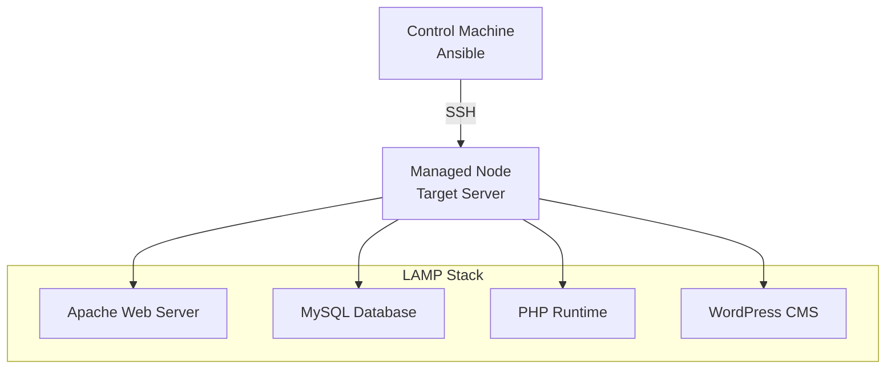

# CMS DevOps Deployment dengan Ansible

[](https://ansible.com/)
[](https://wordpress.org/)
[](https://apache.org/)
[](https://mysql.com/)

## Table of Contents
- [Overview](#overview)
- [Prerequisites](#prerequisites)
- [Architecture](#architecture)
- [Installation Guide](#installation-guide)
- [Playbook Analysis](#playbook-analysis)
- [Accessing CMS](#accessing-cms)
- [Troubleshooting](#troubleshooting)
- [Security](#security)

## Overview

Proyek ini mengotomatisasi deployment **WordPress CMS** menggunakan **Ansible** dengan arsitektur **LAMP Stack**.

### What You'll Learn
- Infrastructure as Code dengan Ansible
- Automated LAMP Stack deployment
- WordPress installation & configuration
- DevOps best practices

### Project Structure
```
cms-devops-deployment/
├── install_cms.yaml        # Main playbook
├── inventory              # Server inventory
├── README.md             # This guide
└── group_vars/           # Variables (optional)
```

## Prerequisites

### System Requirements
| Component | Requirement |
|-----------|-------------|
| **OS** | Ubuntu 18.04+ / Debian 9+ |
| **RAM** | Minimum 1GB |
| **Storage** | 5GB free space |

### Software Requirements
- **Control Machine**: Ansible 2.9+, Python 3.6+, SSH Client
- **Managed Node**: Ubuntu/Debian, SSH Server, sudo access

## Architecture



## Installation Guide

### Step 1: Environment Setup

**Connect to Managed Node:**
```bash
ssh user@managed_node_ip
```

**Install Base Packages:**
```bash
sudo apt update
sudo apt install apache2 mysql-server php libapache2-mod-php php-mysql -y
sudo apt install python3-mysqldb -y
```

### Step 2: Create Playbook

Create `install_cms.yaml`:

```yaml
---
- name: Install WordPress CMS
  hosts: cloud
  become: yes
  vars:
    wp_db_name: wordpress
    wp_db_user: wp_user  
    wp_db_password: SecurePassword123!
    
  tasks:
    - name: Install Apache Web Server
      apt:
        name: apache2
        state: present
        update_cache: yes

    - name: Install MySQL Database
      apt:
        name: mysql-server
        state: present

    - name: Install PHP Runtime
      apt:
        name: php
        state: present

    - name: Install PHP MySQL Extension
      apt:
        name: php-mysql
        state: present

    - name: Start & Enable Apache
      service:
        name: apache2
        state: started
        enabled: yes

    - name: Download WordPress Latest
      get_url:
        url: https://wordpress.org/latest.tar.gz
        dest: /tmp/wordpress.tar.gz

    - name: Extract WordPress Files
      unarchive:
        src: /tmp/wordpress.tar.gz
        dest: /var/www/html/
        remote_src: yes

    - name: Set WordPress Ownership
      file:
        path: /var/www/html/wordpress
        owner: www-data
        group: www-data
        recurse: yes

    - name: Create WordPress Database
      mysql_db:
        name: "{{ wp_db_name }}"
        state: present

    - name: Create Database User
      mysql_user:
        name: "{{ wp_db_user }}"
        password: "{{ wp_db_password }}"
        host: localhost
        priv: "{{ wp_db_name }}.*:ALL"
        state: present

    - name: Verify Services Running
      service:
        name: "{{ item }}"
        state: started
      loop:
        - apache2
        - mysql
```

### Step 3: Create Inventory

Create `inventory` file:
```ini
[cloud]
192.168.1.100 ansible_user=ubuntu ansible_ssh_private_key_file=~/.ssh/id_rsa

[cloud:vars]
ansible_python_interpreter=/usr/bin/python3
```

### Step 4: Run Deployment

```bash
# Test connectivity
ansible -i inventory cloud -m ping

# Deploy CMS
ansible-playbook -i inventory install_cms.yaml

# Run with verbose output
ansible-playbook -i inventory install_cms.yaml -v
```

## Playbook Analysis

### Package Installation Tasks (1-4)
**Purpose:** Install LAMP stack components

```yaml
- name: Install Apache Web Server
  apt:
    name: apache2
    state: present
    update_cache: yes
```

- `apt` module manages Debian/Ubuntu packages
- `state: present` ensures package is installed
- `update_cache` refreshes package lists

### Service Management (Task 5)
**Purpose:** Ensure Apache starts automatically

```yaml
- name: Start & Enable Apache
  service:
    name: apache2
    state: started
    enabled: yes
```

- `state: started` starts service now
- `enabled: yes` auto-starts on boot

### WordPress Download & Extract (Tasks 6-7)
**Purpose:** Get WordPress files to web directory

```yaml
- name: Download WordPress Latest
  get_url:
    url: https://wordpress.org/latest.tar.gz
    dest: /tmp/wordpress.tar.gz

- name: Extract WordPress Files
  unarchive:
    src: /tmp/wordpress.tar.gz
    dest: /var/www/html/
    remote_src: yes
```

- `get_url` downloads files from web
- `unarchive` extracts compressed files
- `remote_src: yes` means file exists on target server

### File Permissions (Task 8)
**Purpose:** Set proper ownership for web server

```yaml
- name: Set WordPress Ownership
  file:
    path: /var/www/html/wordpress
    owner: www-data
    group: www-data
    recurse: yes
```

- `www-data` is default Apache user/group
- `recurse: yes` applies to all subdirectories

### Database Setup (Tasks 9-10)
**Purpose:** Create database and user for WordPress

```yaml
- name: Create WordPress Database
  mysql_db:
    name: "{{ wp_db_name }}"
    state: present

- name: Create Database User
  mysql_user:
    name: "{{ wp_db_user }}"
    password: "{{ wp_db_password }}"
    host: localhost
    priv: "{{ wp_db_name }}.*:ALL"
    state: present
```

- `mysql_db` manages MySQL databases
- `mysql_user` manages users and privileges
- `priv: "database.*:ALL"` grants full access to specific database

## Accessing CMS

### WordPress Setup
1. **Access URL:** `http://your_server_ip/wordpress`
2. **Select Language** and click Continue
3. **Database Configuration:**
   ```
   Database Name: wordpress
   Username: wp_user
   Password: SecurePassword123!
   Database Host: localhost
   ```
4. **Site Information:**
   - Set site title, admin username, and strong password
   - Provide admin email address
5. **Complete Installation** and login to admin panel

### Admin Access
- **Admin URL:** `http://your_server_ip/wordpress/wp-admin`
- Use credentials created during setup

## Troubleshooting

### Common Issues

**Database Connection Error:**
```bash
# Check MySQL service
sudo systemctl status mysql
sudo systemctl start mysql

# Test database connection
mysql -u wp_user -p wordpress
```

**403 Forbidden Error:**
```bash
# Fix file permissions
sudo chown -R www-data:www-data /var/www/html/wordpress/
sudo chmod -R 755 /var/www/html/wordpress/
```

**PHP Files Download Instead of Execute:**
```bash
# Enable PHP module
sudo a2enmod php7.4
sudo systemctl restart apache2
```

### Verification Commands
```bash
# Check services
sudo systemctl status apache2
sudo systemctl status mysql

# Check PHP
php -v
php -m | grep mysql

# View logs
sudo tail -f /var/log/apache2/error.log
sudo tail -f /var/log/mysql/error.log
```

## Security

### Essential Security Steps

**MySQL Security:**
```bash
sudo mysql_secure_installation
```

**Strong Passwords:**
- Use complex passwords (12+ characters)
- Mix uppercase, lowercase, numbers, symbols
- Avoid common passwords

**File Permissions:**
```bash
sudo find /var/www/html/wordpress/ -type d -exec chmod 755 {} \;
sudo find /var/www/html/wordpress/ -type f -exec chmod 644 {} \;
sudo chmod 600 /var/www/html/wordpress/wp-config.php
```

**Apache Security:**
```apache
# /etc/apache2/conf-available/security.conf
ServerTokens Prod
ServerSignature Off

<Files ~ "^\.ht">
    Require all denied
</Files>
```

### WordPress Security Checklist
- [ ] Install security plugins (Wordfence, Sucuri)
- [ ] Regular updates (core, plugins, themes)
- [ ] Strong admin passwords
- [ ] Limit login attempts
- [ ] Remove unused plugins/themes
- [ ] Regular backups

## Advanced Usage

### Using Tags
```bash
# Install specific components
ansible-playbook -i inventory install_cms.yaml --tags "apache,php"

# Skip certain tasks
ansible-playbook -i inventory install_cms.yaml --skip-tags "download"
```

### Variables
Create `group_vars/cloud.yml`:
```yaml
wp_db_name: mysite_db
wp_db_user: mysite_user
wp_db_password: "{{ vault_db_password }}"
```

### Vault for Sensitive Data
```bash
# Create encrypted file
ansible-vault create group_vars/vault.yml

# Add sensitive variables
vault_db_password: SuperSecurePassword123!

# Run with vault
ansible-playbook -i inventory install_cms.yaml --ask-vault-pass
```